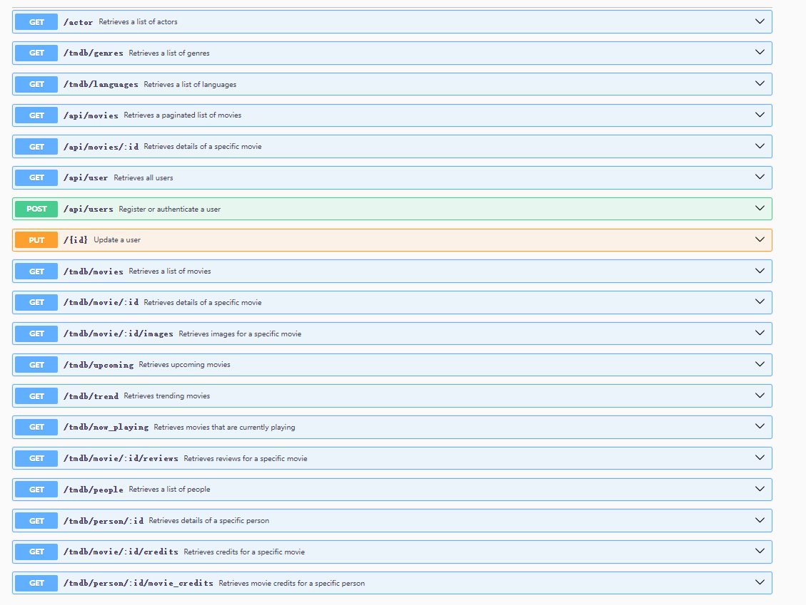
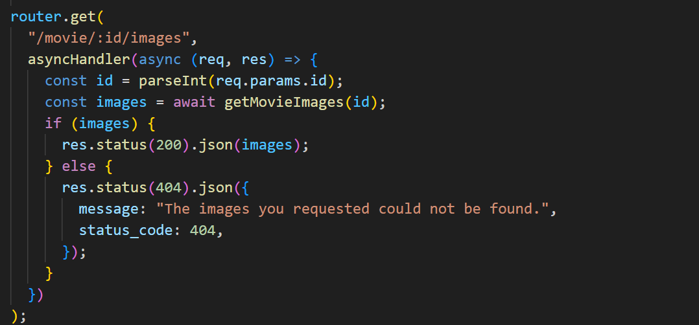

# Assignment 2 - Web API

__Name:__ Xiang Li 20095236

## Features

+ __Movies Genres:__ The database stores the genre data of movies, and implements the movie genre interface.
+ __Movies Languages:__ The movie language related data is stored in the database, and the language acquisition interface is implemented.
+ __Movies Service:__ Handles various requests related to movies, integrates tmdb data acquisition function (e.g., movies, actors, credits detail, etc.)
+ __Favorites:__ The favorites array is added to the user schema to store the favorites information of different users.

## Setup requirements

Clone the repository: git clone <https://github.com/Onion-L/react-movie-app.git>
Install dependencies: npm install
Initialise the database: npm run dev
Start the application: npm run start

## API Configuration

Creating the ".env" file

>NODE_ENV=development
PORT=8080
HOST=localhost
MONGO_DB=MONGO_DB_URL
TMDB_KEY=TMDB_KEY
SECRET=JWT_SECRET_KEY

## API Design

### Actor

+ __GET /actor:__ Retrieves a list of actors.

### Genres

+ __GET /tmdb/genres:__ Retrieves a list of genres.

### Languages

+ __GET /tmdb/languages:__ Retrieves a list of languages.

### Movies

+ __GET /api/movies:__ Retrieves a paginated list of movies.

+ __GET /api/movies/{id}:__ Retrieves details of a specific movie.

+ __GET /tmdb/movies:__ Retrieves a list of movies.

+ __GET /tmdb/movie/{id}:__ Retrieves details of a specific movie.

+ __GET /tmdb/movie/:id/images:__ Retrieves images for a specific movie.

+ __GET /tmdb/upcoming:__ Retrieves upcoming movies.

+ __GET /tmdb/trend:__ Retrieves trending movies.

+ __GET /tmdb/now_playing:__ Retrieves movies that are currently playing.

+ __GET /tmdb/movie/:id/reviews:__ Retrieves reviews for a specific movie.

### User

+ __GET /api/user:__ Retrieves all users.

+ __POST /api/users:__ Register or authenticate a user.

+ __PUT /{id}:__ Update a user.

### People

+ __GET /tmdb/people:__ Retrieves a list of people.

+ __GET /tmdb/person/{id}:__ Retrieves details of a specific person.

### Credits

+ __GET /tmdb/movie/:id/credits:__ Retrieves credits for a specific movie.

+ __GET /tmdb/person/:id/movie_credits:__ Retrieves movie credits for a specific person.

## Security and Authentication

+ movieRouter:Authentication is required before getting data from movieRouter.

## Integrating with React App

To better organize and manage requests related to TMDB data, we have created a service called movieService and set up a router to ensure that all API interactions go through the backend, rather than the frontend directly requesting the TMDB API. This approach helps improve code maintainability and security while allowing us to perform proper authorization and data processing on the backend to meet the frontend's needs. This layered architecture also helps segregate responsibilities between the frontend and backend, making the system more robust and scalable.

## Independent learning (if relevant)

+ __axios:__ The frontend has replaced Fetch with Axios for requests, enhancing functionality and code maintainability.
+ __Swagger:__ Use Swagger to automatically generate API documentation to improve API usability, understandability, and development efficiency.
