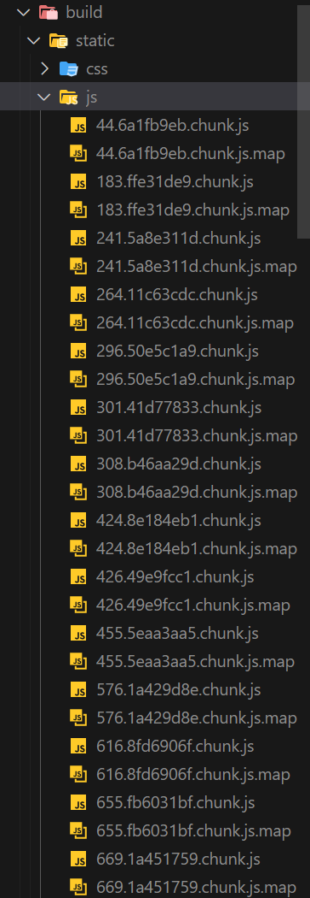
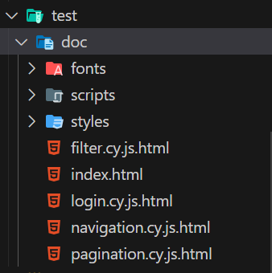
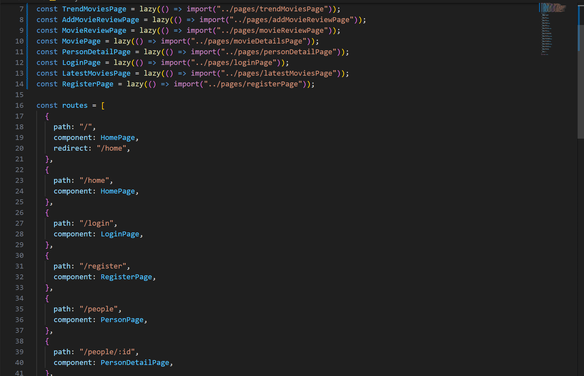
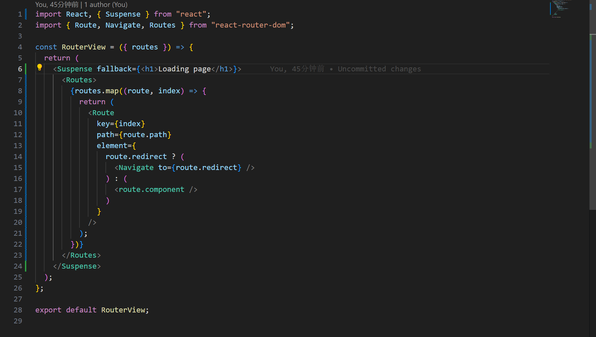
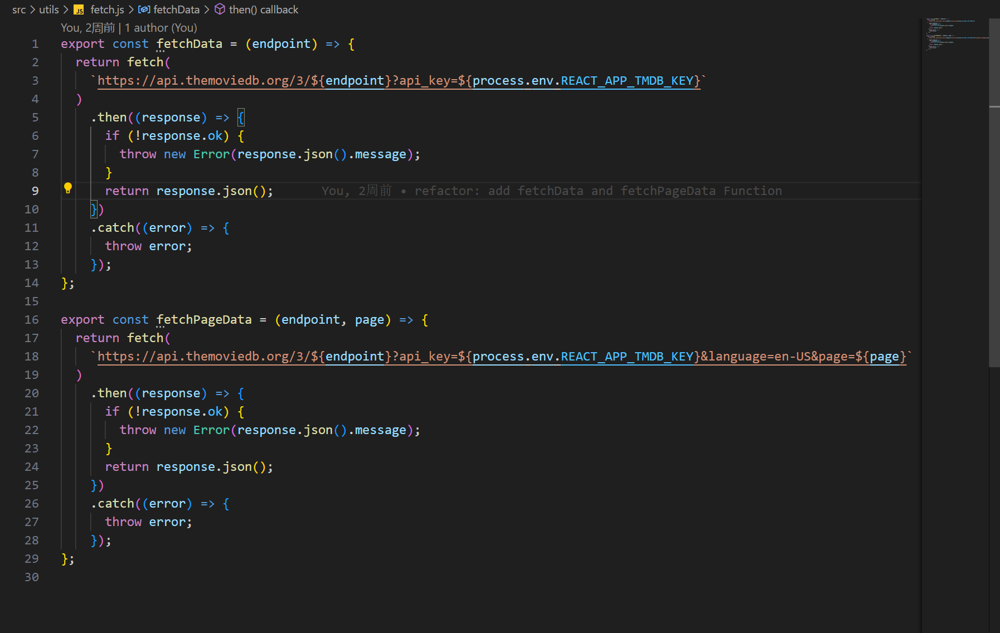

# Assignment 1 - Agile Software Practice

__Name:__ Xiang Li 20095236

This repository contains the implementation of a React App, its associated Cypress tests and the GitLab CI pipeline.

## React App Features

+ Home Page: Displays a list of movies.
+ Latest Movies Page: Shows the latest movies.
+ Login Page: Allows users to log in to the application.
+ Movie Details Page: Provides detailed information about a specific movie.
+ Person Detail Page: Displays detailed information about a specific actor.
+ Person Page: Lists popular actors.
+ Search Page: The results of the search are displayed on this page.
+ Add Movie Review Page: Allows users to add reviews for movies.
+ Trending Movies Page: Showcases movies that are trending.

## Automated Tests

### Unique functionality testing (if relevant)

#### Filter

+ cypress/e2e/filter.cy.js

__Filtering by movie title__ - Allows users to filter the movie list by typing in a specific letter or sequence of letters. Movies that contain the letter 'm' in their titles are displayed accordingly.

__Filtering by movie genre__ - Enables users to filter movies by selecting a genre from the list. For example, selecting 'Drama' will only display movies that are categorized within this genre.

__Filtering by movie language__ - Provides the ability for users to filter movies by the language they are in. Selecting 'English' will display movies that are available in English.

#### Login

+ cypress/e2e/login.cy.js

__User Login__ - Verifies that a user can log in using their credentials. After successful login, the user is redirected to the home page.

__User Sign Up__ - Tests the user registration process with an email address. A unique email is generated for each test to ensure the test's integrity.

__User Logout__ - Checks the logout functionality. After logging out, the user should see the sign-in button, confirming that the logout was successful.

#### Navigation

+ cypress/e2e/navigation.cy.js

__Navigation to Movie Details__ - Confirms that when a user clicks on 'More Info' for a movie, they are directed to the movie details page with the URL reflecting the specific movie ID.

__Navigation from Movie Details to People Page__ - Tests the functionality that allows users to navigate from a movie's details page to the associated people page, updating the URL to the correct person ID.

__Navigation from People Page to Movie Details__ - Ensures that when navigating from a person's profile to their movie credits, the application redirects to the correct movie details page with the appropriate movie ID in the URL.

#### Pagination

+ cypress/e2e/pagination.cy.js

__Next Page Navigation__ - Ensures that the user can navigate to the next page of movies by clicking the 'Next' button. After clicking, a new set of movies should be displayed, indicating the page change.

__Direct Page Selection__ - Tests that the user can jump to a specific page by clicking on the corresponding page number. This is crucial for accessing movies available on non-sequential pages.

__First Page Boundary__ - Verifies that the 'Previous' page button is disabled when the user is on the first page to prevent unnecessary errors or empty page views.

### Error/Exception testing (if relevant)

__Sign up error__ - The error alert will appear if user doesn't input the right format of email when sign up

+ cypress/e2e/login.cy.js

### Cypress Custom commands (if relevant)

+ cypress/e2e/login.cy.js (login)
+ cypress/e2e/filter.cy.js (search)

## Code Splitting

+ src/pages/homePage.js
+ src/pages/personPage.js
+ src/pages/searchPage.js
+ src/pages/favoriteMoviesPage.js
+ src/pages/upcomingMoviesPage.js
+ src/pages/trendMoviesPage.js
+ src/pages/addMovieReviewPage.js
+ src/pages/movieReviewPage.js
+ src/pages/movieDetailsPage.js
+ src/pages/personDetailPage.js
+ src/pages/loginPage.js
+ src/pages/latestMoviesPage.js
+ src/pages/registerPage.js

## Pull Requests

__Github:__ <https://github.com/Onion-L/react-movie-labs>
__Gitlab:__ <https://gitlab.com/Onion-L/react-movie-labs>

## Independent learning (If relevant)

### build and code spliting

The code splits the component into separate chunks according to the route

### Test Document

Use JSDoc to complete the test documentation

### encapsulation of routes

Encapsulate the route's paths and components into an array of routes objects, and then encapsulate the routes into a routeView file

+ router/index.js

+ router/routerView.js

### Wrap API request methods

Abstract the api request into two functions

